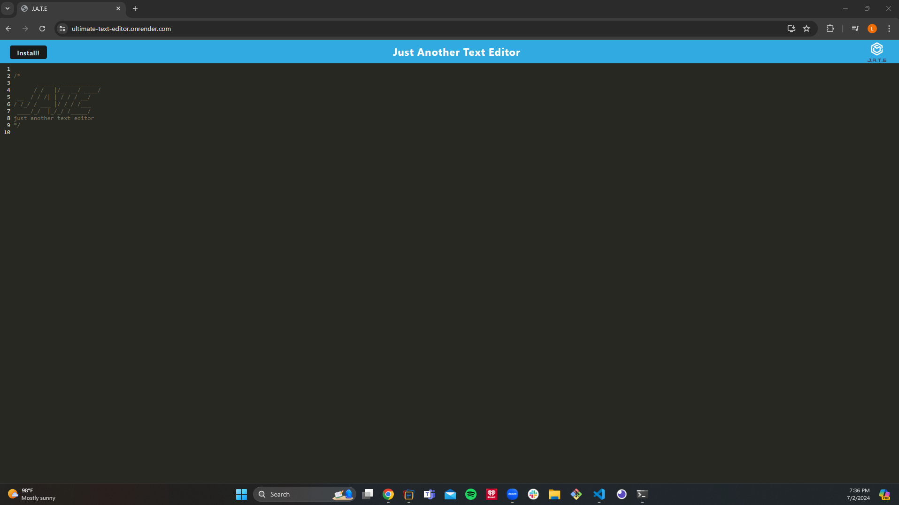

# Luis's Ultimate Text Editor Website (Module 19 PWA)

## This Challenge contains Luis's Ultimate Text Editor Website to include the following functions:

- Allows my users to create notes or code snippets with or without an internet connection so that they can reliably retrieve them for later use.

## Installation

- Develop directory (root directory)

  - cd Develop
  - npm init -y
  - npm install --save-dev concurrently nodemon
  - npm install express if-env
  - add the following to the "scripts" section:
    - "start:dev": "concurrently \"cd client && npm run build\" \"cd server && npm run server\" ",
    - "start": "npm run build && cd server && node server.js",
    - "server": "cd server node server.js --ignore client",
    - "build": "cd client && npm run build",
    - "install": "cd server && npm i && cd ../client && npm i",
    - "client": "cd client && npm start"

- client folder

  - cd Develop/client
  - npm init -y
  - npm install --save-dev @babel/core @babel/plugin-proposal-object-rest-spread @babel/plugin-transform-runtime @babel/preset-env @babel/runtime babel-loader
  - npm install --save-dev css-loader style-loader
  - npm install --save-dev html-webpack-plugin http-server webpack webpack-cli webpack-dev-server webpack-pwa-manifest workbox-webpack-plugin
  - npm install code-mirror-themes idb
  - add the following to "scripts" section:
    - "dev": "webpack-dev-server",
    - "build": "webpack --mode production",
    - "start": "webpack --watch"

- server folder
  - cd Develop/server
  - npm init -y
  - npm install --save-dev nodemon
  - npm install express
  - add the following to the "scripts" section:
    - "server": "nodemon server.js --ignore client"

## Usage and Testing

1. Start server:

- Open a new Git Bash terminal
- Go to the Ultimate-Text-Editor directory
- Once in the Ultimate-Text-Editor directory type 'code .'
- Once VS Code pulls up open the Git Bash terminal within VS Code and go to the root directory so type in terminal 'cd Develop'
- Type 'npm run build' so that application is built
- Type 'npm run start'(At this point, the server is running and you should get the message that states "Now listening on port:3000")

2. Testing:

- In the URL box type 'http://localhost:3001' and the text editor website should come up
- The install button should be in the window's top left corner. When clicked it should download the web application to your desktop.

## Website URL and GitHub Repository Links

- To access the website for the text editor: [Luis's Ultimate Text Editor Website](https://ultimate-text-editor.onrender.com)
- To access Luis's Ultimate Text Editor repository: [Luis's Ultimate Text Editor repository](https://github.com/ricanlonghorn23/Ultimate-Text-Editor.git)

## Screenshot of website

## Credits

Luis Aldaz
